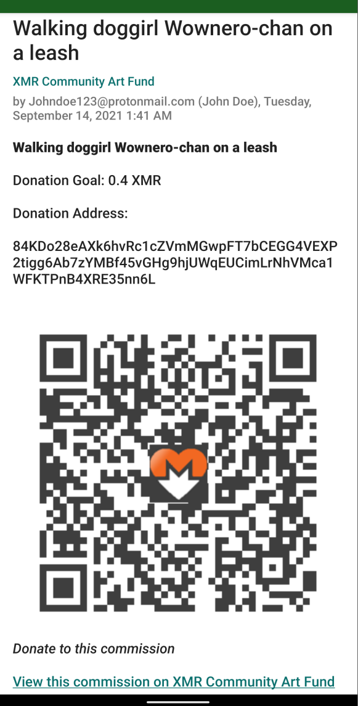

# xmr-wishlist-rss

Keep your donors in the loop: generate a Monero RSS feed from your XMR Wishlist!

Simply update your wishlist and wishlist-rss, and your donors will receive an update without having to constantly check your website/Twitter to be notified of new requests.

<center>
	
</center>
<center>
	
</center>

# Table of Contents
- [xmr-wishlist-rss](#xmr-wishlist-rss)
- [Table of Contents](#table-of-contents)
- [Test it Out!](#test-it-out)
- [Usage](#usage)

# Test it Out!

Open this link on a mobile/desktop device that has an RSS reader installed (or just manually copy and paste the link into your RSS reader): https://raw.githubusercontent.com/CryptoGrampy/xmr-wishlist-rss/master/dist/xmr-community-art-fund-wishlist-rss2.xml


# Usage

1. Pass a link to your [XMR wishlist as a service](https://github.com/plowsof/xmr-wishlist-aaS) json file into the JS method:

```node
generateRssFromWishlistUrl('https://github.com/CryptoGrampy/xmr-wishlist-rss/blob/master/wishlist-aas-example-v2.json')
```

OR

2. Pipe in your wishlist JSON:

```node
generateRssFromWishlist(wishlistJson)
```

Add a link to the output RSS file to your website!  Update the file whenever a new item is added to your list.  Ensure your wishlist.json matches the XmrWishlistV2 format.
